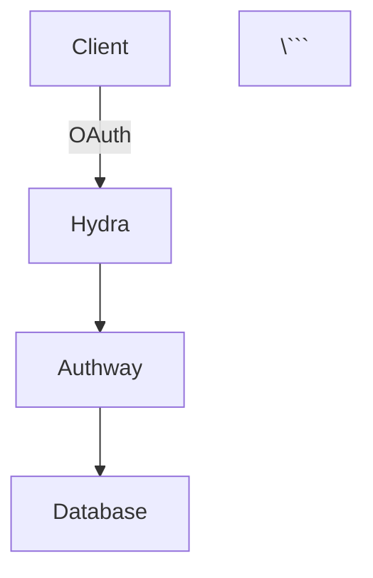

# 📚 Authway Admin Dashboard - 문서 관리 기능

Admin Dashboard에 통합된 강력한 문서 관리 시스템입니다.

## ✨ 주요 기능

### 1. 📂 파일 트리 네비게이션
- `/docs` 디렉토리의 전체 구조를 트리 형태로 표시
- 폴더/파일 구분 및 계층 구조 시각화
- 폴더 펼치기/접기 기능
- 실시간 파일 목록 로딩

### 2. 🔍 전문 검색
- 파일명 검색
- 파일 내용 전체 텍스트 검색
- 검색 결과 하이라이팅
- 즉시 검색 결과 표시

### 3. 📖 마크다운 뷰어
- **GitHub Flavored Markdown (GFM)** 지원
- **코드 하이라이팅** - 다양한 언어 지원
- **테이블** - 자동 포맷팅
- **체크리스트** - `- [ ]` 문법 지원
- **링크 및 이미지** - 자동 렌더링
- **HTML** - 안전한 HTML 렌더링 (rehype-raw)
- **수식** - LaTeX 수식 지원 (향후 확장 가능)

### 4. 📥 다운로드 기능
- 개별 파일 다운로드
- 원본 마크다운 파일 유지

### 5. 🎨 반응형 UI
- 3-컬럼 레이아웃
  - 헤더 (검색 바)
  - 사이드바 (파일 트리)
  - 메인 컨텐츠 (마크다운 뷰어)
- 모바일 친화적 디자인
- 다크 모드 준비 완료

## 🔐 보안

### 읽기 권한
- **공개**: 모든 사용자가 문서 읽기 가능
- 인증 불필요 (현재 구성)

### 쓰기 권한
- **Admin 전용**: Admin API Key 필요
- 파일 업로드/수정/삭제는 관리자만 가능

### 경로 보안
- 디렉토리 순회 공격 방지 (`..` 차단)
- 절대 경로 검증
- 파일 시스템 격리

## 🛠️ 기술 스택

### Backend (Go)
```go
// 주요 API 엔드포인트
GET  /api/v1/docs              // 문서 목록
GET  /api/v1/docs/*            // 문서 내용
GET  /api/v1/docs/search?q=    // 검색
GET  /api/v1/docs/download/*   // 다운로드
PUT  /api/v1/docs/*            // 수정 (Admin)
DELETE /api/v1/docs/*          // 삭제 (Admin)
POST /api/v1/docs/upload       // 업로드 (Admin)
```

### Frontend (React + TypeScript)
- **React 18** - UI 프레임워크
- **react-markdown** - 마크다운 파싱
- **remark-gfm** - GitHub Flavored Markdown
- **rehype-raw** - HTML 렌더링
- **react-syntax-highlighter** - 코드 하이라이팅
- **@tailwindcss/typography** - 타이포그래피 스타일링
- **axios** - API 통신

## 📦 패키지 의존성

```json
{
  "dependencies": {
    "react-markdown": "^10.1.0",
    "remark-gfm": "^4.0.1",
    "rehype-raw": "^7.0.0",
    "react-syntax-highlighter": "^15.5.0",
    "@types/react-syntax-highlighter": "^15.5.11",
    "@tailwindcss/typography": "^0.5.10"
  }
}
```

## 🚀 사용 방법

### 1. 문서 탐색
1. Admin Dashboard 로그인
2. 좌측 메뉴에서 **"문서"** 클릭
3. 사이드바에서 폴더/파일 선택
4. 메인 영역에서 렌더링된 문서 확인

### 2. 문서 검색
1. 헤더의 검색 바에 키워드 입력
2. Enter 키 또는 "검색" 버튼 클릭
3. 검색 결과에서 원하는 문서 선택

### 3. 문서 다운로드
1. 문서 뷰어에서 다운로드 아이콘 클릭
2. 원본 마크다운 파일 다운로드

## 🎯 활용 사례

### 개발자 가이드 관리
```
docs/
├── quick-start.md
├── API_INTRODUCTION.md
├── INTEGRATION_GUIDE.md
├── quickstart/
│   ├── DOTNET_QUICKSTART.md
│   ├── JAVASCRIPT_QUICKSTART.md
│   ├── PYTHON_QUICKSTART.md
│   └── GO_QUICKSTART.md
├── features/
│   └── DYNAMIC_CLAIMS.md
└── deployment/
    └── azure-architecture.md
```

### API 문서
- OpenAPI/Swagger 대신 마크다운으로 API 문서 작성
- 코드 예제 포함
- 실시간 업데이트

### 릴리스 노트
- CHANGELOG.md 버전별 변경사항
- 마이그레이션 가이드
- 주의사항

### 팀 위키
- 프로젝트 규칙
- 아키텍처 결정 기록 (ADR)
- 트러블슈팅 가이드

## 🔧 확장 가능성

### 향후 추가 가능한 기능

#### 1. 편집 기능
```typescript
// Editor Modal Component
const [isEditing, setIsEditing] = useState(false)
const [editContent, setEditContent] = useState('')

// 실시간 프리뷰 기능
<CodeMirror
  value={editContent}
  extensions={[markdown()]}
  onChange={(value) => setEditContent(value)}
/>
```

#### 2. 버전 관리
- Git 통합
- 수정 이력 추적
- Diff 뷰어

#### 3. 협업 기능
- 댓글 시스템
- 문서 승인 워크플로우
- 변경 알림

#### 4. 고급 검색
- 정규표현식 검색
- 태그 기반 필터링
- 날짜 범위 검색

#### 5. 내보내기
- PDF 변환
- HTML 정적 사이트 생성
- Word/DOCX 변환

#### 6. Mermaid 다이어그램
```markdown


#### 7. 다국어 지원
- i18n 통합
- 언어별 문서 버전
- 자동 번역 제안

## 📝 마크다운 작성 팁

### 코드 블록
\```go
func main() {
    fmt.Println("Hello, Authway!")
}
\```

### 테이블
| Feature | Status |
|---------|--------|
| 읽기 | ✅ |
| 검색 | ✅ |
| 편집 | 🚧 |

### 체크리스트
- [x] 백엔드 API 구현
- [x] 프론트엔드 UI 구현
- [ ] 편집 기능 추가
- [ ] 버전 관리 통합

### 주의사항 (Callouts)
> **💡 팁**: 마크다운 파일은 UTF-8 인코딩을 사용하세요.
>
> **⚠️ 경고**: 대용량 이미지는 성능에 영향을 줄 수 있습니다.

## 🐛 문제 해결

### 문서가 표시되지 않음
- `docs/` 디렉토리 경로 확인
- 백엔드 서버 로그 확인
- CORS 설정 확인

### 검색이 느림
- 문서 수 확인 (1000개 이상 시 인덱싱 고려)
- 파일 크기 확인 (대용량 파일 분할)

### 코드 하이라이팅 안됨
- 언어 지정 확인 (\```go, \```javascript 등)
- react-syntax-highlighter 설치 확인

## 📄 라이선스

이 기능은 Authway 프로젝트의 일부로 동일한 라이선스가 적용됩니다.

---

**버전**: 1.0.0
**최종 업데이트**: 2025-10-26
