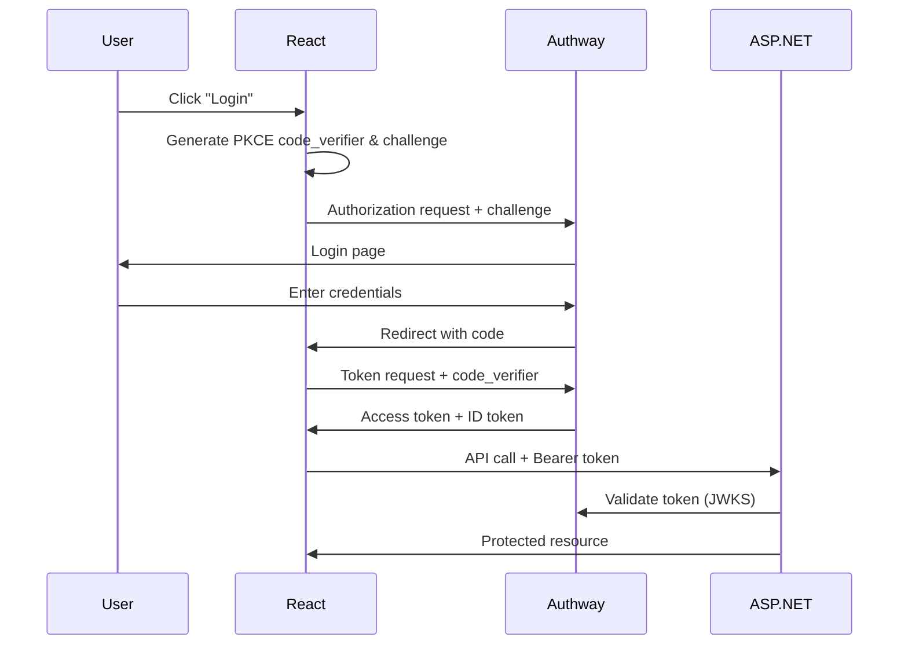

# Authway SPA Sample

ASP.NET Backend + Frontend (React & Vanilla JS) with OAuth2 PKCE authentication.

## 🏗️ Architecture

This sample demonstrates **backend-frontend separation** with **two frontend implementations**:

```
asp-spa/
├── asp-backend/              # ASP.NET Web API (JWT Bearer)
│   └── AuthwaySpaBackend/
│       ├── Program.cs        # API endpoints with JWT authentication
│       └── appsettings.json
│
├── asp-frontend/             # React + @authway/react SDK
│   ├── src/
│   │   ├── App.tsx           # Main app with AuthwayProvider
│   │   ├── config.ts         # Authway configuration
│   │   └── components/
│   │       ├── LoginButton.tsx   # Login with Authway
│   │       ├── UserProfile.tsx   # Display user info
│   │       └── ApiTester.tsx     # Test protected APIs
│   └── package.json
│
└── asp-frontend-vanilla/     # Vanilla JS + oauth4webapi
    ├── src/
    │   ├── auth.js           # OAuth2 PKCE implementation
    │   ├── api.js            # Protected API client
    │   ├── config.js         # Configuration
    │   └── main.js           # App logic
    └── public/
        ├── index.html        # Main page
        └── callback.html     # OAuth callback handler
```

## 🎯 Two Implementation Approaches

### 1. React with Authway SDK (`asp-frontend/`)
- ✅ Production-ready with `@authway/react` and `@authway/client`
- ✅ Built-in token management, refresh, and caching
- ✅ React hooks (useAuth)
- ✅ TypeScript for type safety
- **Best for**: Production applications, teams familiar with React

### 2. Vanilla JS with oauth4webapi (`asp-frontend-vanilla/`)
- ✅ Zero framework dependencies (just Vite for dev server)
- ✅ Direct oauth4webapi usage for learning
- ✅ Manual token management and PKCE implementation
- ✅ Both redirect and popup authentication
- **Best for**: Learning OAuth2 internals, framework-agnostic projects

> **💡 Key Learning**: The vanilla implementation reveals OAuth2 PKCE mechanics that SDKs abstract away, making it excellent for understanding authentication flows.

## ✨ Features

### Frontend (React - `asp-frontend/`)
- ✅ Uses `@authway/react` and `@authway/client` packages from monorepo
- ✅ OAuth2 PKCE Flow with **redirect** and **popup** authentication modes
- ✅ Automatic token management
- ✅ Protected API calls with Bearer token
- ✅ Modern React hooks (useAuth, loginWithRedirect, loginWithPopup)
- ✅ TypeScript for type safety

### Frontend (Vanilla - `asp-frontend-vanilla/`)
- ✅ Pure JavaScript with `oauth4webapi` (official OAuth 2.0 library)
- ✅ Manual PKCE implementation for learning
- ✅ Both redirect and popup authentication flows
- ✅ Dynamic claims management with Authway Central API
- ✅ Session-based token storage
- ✅ No framework dependencies

### Backend (ASP.NET)
- ✅ JWT Bearer Authentication validates access tokens from Authway
- ✅ CORS Configuration for frontend origin
- ✅ Protected API Endpoints:
  - `GET /api/public` - No authentication
  - `GET /api/protected` - Requires authentication
  - `GET /api/me` - User profile
  - `GET /api/weather` - Sample protected data

## 🚀 Quick Start

### Prerequisites
- .NET 9.0 SDK
- Node.js 18+ with pnpm
- Authway running (local or Azure: `https://authway-api.iyulab.com`)

### 1. Install Dependencies

From the **monorepo root** (`D:\data\Authway`):

```bash
# Install all dependencies including @authway/react and @authway/client
pnpm install
```

This will automatically link the workspace packages.

### 2. Register OAuth2 Client in Authway

```bash
cd samples/asp-spa
./setup-client.ps1
```

Or manually register via Authway Admin:
- **Client ID**: `authway_spa_sample`
- **Client Type**: Public (PKCE required)
- **Redirect URIs**: `http://localhost:5173`
- **Grant Types**: `authorization_code`, `refresh_token`
- **Scopes**: `openid`, `profile`, `email`

### 3. Start Backend API

```bash
cd asp-backend/AuthwaySpaBackend
dotnet run
```

Backend will start on `http://localhost:5222`

### 4. Start Frontend React App

```bash
cd asp-frontend
pnpm dev
```

Frontend will start on `http://localhost:5173`

### 4b. Start Vanilla JS App (Alternative)

```bash
cd asp-frontend-vanilla
pnpm dev
```

Frontend will start on `http://localhost:5174`

> **Note**: Both frontends share the same backend on port 5222

## ⚙️ Configuration

### Backend: `appsettings.json`

```json
{
  "Authway": {
    "Authority": "https://authway-api.iyulab.com",
    "Audience": "api",
    "RequireHttpsMetadata": true
  },
  "Cors": {
    "AllowedOrigins": ["http://localhost:5173"]
  }
}
```

### Frontend: `src/config.ts`

```typescript
export const AUTHWAY_CONFIG = {
  issuer: 'https://authway-api.iyulab.com',
  clientId: 'authway_spa_sample',
  redirectUri: window.location.origin,
  scope: 'openid profile email',
  apiBaseUrl: 'http://localhost:5222',
};
```

## 📦 Using Authway Packages

### 1. AuthwayProvider Setup

Wrap your app with `AuthwayProvider`:

```tsx
import { AuthwayProvider } from '@authway/react';

function App() {
  return (
    <AuthwayProvider
      issuer="https://authway-api.iyulab.com"
      clientId="authway_spa_sample"
      redirectUri={window.location.origin}
      scope="openid profile email"
    >
      <AppContent />
    </AuthwayProvider>
  );
}
```

### 2. useAuth Hook

Access authentication state and methods:

**Redirect-based Login** (traditional):
```tsx
import { useAuth } from '@authway/react';

function LoginButton() {
  const { loginWithRedirect } = useAuth();

  return (
    <button onClick={() => loginWithRedirect()}>
      Login with Redirect
    </button>
  );
}
```

**Popup-based Login** (modern, no page reload):
```tsx
import { useAuth } from '@authway/react';

function LoginButton() {
  const { loginWithPopup } = useAuth();

  const handleLogin = async () => {
    try {
      await loginWithPopup({
        width: 500,
        height: 700
      });
      console.log('Login successful!');
    } catch (error) {
      console.error('Login failed:', error);
    }
  };

  return (
    <button onClick={handleLogin}>
      Login with Popup
    </button>
  );
}

function UserProfile() {
  const { user, isAuthenticated, accessToken, logout } = useAuth();

  if (!isAuthenticated) {
    return <div>Please login</div>;
  }

  return (
    <div>
      <p>Welcome {user.name}</p>
      <button onClick={() => logout()}>Logout</button>
    </div>
  );
}
```

### 3. Protected API Calls

Use the access token for authenticated requests:

```tsx
const { accessToken } = useAuth();

const response = await fetch('http://localhost:5222/api/protected', {
  headers: {
    'Authorization': `Bearer ${accessToken}`,
  },
});
```

## 🔄 OAuth2 PKCE Flow



## 🧪 Testing

### 1. Test Public API (No Auth)
```bash
curl http://localhost:5222/api/public
```

### 2. Test Protected API (With Auth)
```bash
curl http://localhost:5222/api/protected \
  -H "Authorization: Bearer <access_token>"
```

### 3. Test in Browser
1. Open `http://localhost:5173`
2. Click "Login with Authway"
3. Login with your credentials
4. Test API endpoints using the buttons

## 📁 Key Files

| File | Purpose |
|------|---------|
| `asp-frontend/src/App.tsx` | Main app with AuthwayProvider |
| `asp-frontend/src/config.ts` | Authway configuration |
| `asp-frontend/src/components/LoginButton.tsx` | Login button using useAuth |
| `asp-frontend/src/components/UserProfile.tsx` | User profile display |
| `asp-frontend/src/components/ApiTester.tsx` | API testing UI |
| `asp-backend/AuthwaySpaBackend/Program.cs` | ASP.NET API with JWT auth |
| `asp-frontend-vanilla/src/auth.js` | Manual OAuth2 PKCE implementation |
| `asp-frontend-vanilla/src/api.js` | Protected API client |
| `asp-frontend-vanilla/public/callback.html` | Popup OAuth callback |

## 📖 Lessons Learned

### OAuth2 and PKCE Implementation

#### 1. **oauth4webapi Security Defaults**
The `oauth4webapi` library enforces HTTPS by default for security. For local development with HTTP:

```javascript
// Required for HTTP in local dev (NEVER in production)
const response = await oauth.discoveryRequest(issuer, {
  [oauth.allowInsecureRequests]: true
});
```

**Key Learning**: This flag is required in multiple places: discovery, token exchange, and validation.

#### 2. **Audience Parameter Confusion**
**Critical Issue**: Even with Hydra client configured with `audience: ["api"]`, tokens won't include audience claims unless explicitly requested.

```javascript
// Hydra client config (whitelist only)
{
  "audience": ["api"]  // Allows 'api', but doesn't auto-include
}

// Must explicitly request in authorization URL
authUrl.searchParams.set('audience', 'api');  // ← Required!
```

**Why This Matters**: ASP.NET JWT validation requires matching `aud` claim. Without explicit request, backend validation fails with `IDX10206: Unable to validate audience`.

**Temporary Workaround** (Program.cs:38):
```csharp
ValidateAudience = false,  // TEMPORARILY DISABLED FOR DEBUGGING
```

> **⚠️ Production Note**: This requires investigation into Hydra audience configuration. The whitelist should work, but appears to need additional setup.

#### 3. **oauth4webapi API Patterns**
Common mistakes when migrating from other OAuth libraries:

```javascript
// ❌ Wrong: oauth4webapi throws errors, no error objects
if (oauth.isOAuth2Error(result)) { }

// ✅ Right: Use try-catch
try {
  const result = await oauth.authorizationCodeGrantRequest(...)
} catch (error) {
  console.error('Token exchange failed:', error);
}

// ❌ Wrong: Missing validation step
const result = await oauth.authorizationCodeGrantRequest(
  authorizationServer, client, params, redirectUri, codeVerifier
);

// ✅ Right: Validate first
const validatedParams = oauth.validateAuthResponse(
  authorizationServer, client, callbackUrl, storedState
);
const result = await oauth.authorizationCodeGrantRequest(
  authorizationServer, client, oauth.None(), // ← Public client auth
  validatedParams, redirectUri, codeVerifier
);

// ❌ Wrong: Incorrect function name
await oauth.processAuthorizationCodeOpenIDResponse(...)

// ✅ Right: Correct function with option
await oauth.processAuthorizationCodeResponse(
  authorizationServer, client, response,
  { requireIdToken: true }
);
```

#### 4. **Dynamic Claims in `ext` Namespace**
Authway stores custom claims in `ext` to avoid conflicts:

```javascript
// Token structure
{
  "sub": "user-123",
  "name": "John Doe",
  "ext": {
    "department": "Engineering",  // Custom claims here
    "role": "admin"
  }
}
```

**Benefits**:
- ✅ Avoids conflicts with standard OAuth/OIDC claims
- ✅ Clear separation of standard vs custom data
- ✅ Backward compatible claim additions

**API Usage**:
```javascript
// Update custom claim
await fetch('/api/v1/claims/user', {
  method: 'PATCH',
  body: JSON.stringify({ claims: { department: 'Sales' } })
});
```

#### 5. **Popup vs Redirect Authentication**
Both patterns share PKCE logic but differ in state management:

```javascript
// Redirect: Uses main window session
sessionStorage.setItem('code_verifier', codeVerifier);
sessionStorage.setItem('oauth_state', state);

// Popup: Uses separate keys to avoid conflicts
sessionStorage.setItem('popup_code_verifier', codeVerifier);
sessionStorage.setItem('popup_oauth_state', state);
```

**Popup Communication**:
```javascript
// callback.html sends postMessage to opener
window.opener.postMessage({
  type: 'oauth-callback',
  code, state, error
}, window.location.origin);
```

**Key Learning**: Separate session keys prevent conflicts when user opens multiple tabs or switches between redirect/popup modes.

#### 6. **ASP.NET JWT Claims Handling**
Multiple claims with same type cause `ToDictionary` errors:

```csharp
// ❌ Wrong: Fails with duplicate 'scope' claims
claims = user.Claims.ToDictionary(c => c.Type, c => c.Value)

// ✅ Right: Handle multiples with GroupBy
claims = user.Claims
    .GroupBy(c => c.Type)
    .ToDictionary(
        g => g.Key,
        g => g.Count() > 1
            ? (object)g.Select(c => c.Value).ToArray()
            : g.First().Value
    )
```

**Why**: JWT `scp` array claim converts to multiple ASP.NET `scope` claims.

### Architecture Decisions

#### Unified Backend Port (5222)
Both React and Vanilla frontends share the same ASP.NET backend for consistency:

**Benefits**:
- ✅ Single backend instance for testing both versions
- ✅ Consistent JWT validation and CORS configuration
- ✅ Easier comparison between implementations

**Implementation**:
- React frontend: `http://localhost:5173` → Backend: `http://localhost:5222`
- Vanilla frontend: `http://localhost:5174` → Backend: `http://localhost:5222`
- Backend health check prevents duplicate instances

#### Client Registration Strategy
Single OAuth client supports both frontends with multiple redirect URIs:

```powershell
# setup-client-local.ps1
$REDIRECT_URIS = @(
    "http://localhost:5173",      # React redirect
    "http://localhost:5173/callback.html",  # React popup (unused)
    "http://localhost:5174",      # Vanilla redirect
    "http://localhost:5174/callback.html"   # Vanilla popup
)
```

**Why**: Simplifies client management while supporting both implementations.

## 🐛 Troubleshooting

### Package Not Found Errors

If you see errors like `Cannot find module '@authway/react'`:

```bash
# From monorepo root
pnpm install

# Rebuild packages
cd packages/client && pnpm build
cd ../react && pnpm build
```

### CORS Error

- Ensure backend CORS origin matches frontend URL exactly
- Check browser console for specific CORS error details
- Verify `appsettings.json` has `http://localhost:5173` in allowed origins

### Token Validation Failed

- Verify `Authority` in backend matches Authway issuer
- Check that access token is JWT format (not opaque)
- Ensure JWKS endpoint is accessible: `https://authway-api.iyulab.com/.well-known/jwks.json`

### Login Redirect Loop

- Clear browser sessionStorage: `sessionStorage.clear()`
- Verify redirect_uri matches exactly (including trailing slash)
- Check client is registered with correct redirect URIs

## 🔐 Security Considerations

- ✅ **PKCE Required**: Frontend uses PKCE to protect against authorization code interception
- ✅ **Token Storage**: Access tokens stored in memory by `@authway/client`
- ✅ **HTTPS in Production**: Always use HTTPS for production deployments
- ✅ **Token Expiry**: Backend validates token expiry automatically
- ✅ **CORS**: Configure specific origins in production, not wildcard

## 🪟 Popup Login Configuration Options

The `@authway/react` SDK supports both **redirect** and **popup** authentication modes. For popup mode, you have **3 callback options**:

### Option 1: Use Own Application URL (Current Default)

**Configuration** (`src/config.ts`):
```typescript
export const AUTHWAY_CONFIG = {
  issuer: 'https://authway-api.iyulab.com',
  clientId: 'authway_spa_sample',
  redirectUri: window.location.origin,  // ← Your app URL
  scope: 'openid profile email',
};
```

**When to use**: When you want full control and can handle OAuth callback

**Note**: Your application must handle the OAuth callback and send postMessage

### Option 2: Use Authway Login-UI Hosted Callback (Recommended)

**Configuration** (`src/config.ts`):
```typescript
export const AUTHWAY_CONFIG = {
  issuer: 'https://authway-api.iyulab.com',
  clientId: 'authway_spa_sample',
  redirectUri: 'https://login.authway.com/popup-callback',  // ← Hosted by Authway
  scope: 'openid profile email',
};
```

**Benefits**:
- ✅ Zero configuration - works out of the box
- ✅ Always up-to-date with security patches
- ✅ No deployment needed for callback page
- ✅ Centrally managed by Authway

**Register Redirect URI** in Authway Admin:
```
https://login.authway.com/popup-callback
```

### Option 3: Use Authway Backend Hosted Callback

**Configuration** (`src/config.ts`):
```typescript
export const AUTHWAY_CONFIG = {
  issuer: 'https://authway-api.iyulab.com',
  clientId: 'authway_spa_sample',
  redirectUri: 'https://authway-api.iyulab.com/oauth/popup-callback',  // ← Backend endpoint
  scope: 'openid profile email',
};
```

**Benefits**:
- ✅ Backend-controlled
- ✅ Additional logging/analytics possible
- ✅ Custom branding if needed

**Register Redirect URI** in Authway Admin:
```
https://authway-api.iyulab.com/oauth/popup-callback
```

### Usage with @authway/react

Both popup and redirect modes work with all three callback options:

```tsx
import { useAuth } from '@authway/react';

function LoginButton() {
  const { loginWithRedirect, loginWithPopup } = useAuth();

  return (
    <>
      {/* Traditional redirect - works with all callback options */}
      <button onClick={() => loginWithRedirect()}>
        Login with Redirect
      </button>

      {/* Modern popup - works with all callback options */}
      <button onClick={() => loginWithPopup({ width: 500, height: 700 })}>
        Login with Popup
      </button>
    </>
  );
}
```

**See complete guide**: [Popup Login Integration](../../docs/features/POPUP_LOGIN_INTEGRATION.md)

## 📚 Documentation

- [@authway/react Package](../../packages/react/README.md)
- [@authway/client Package](../../packages/client/README.md)
- [Authway Documentation](../../docs/)

## 📝 License

MIT
